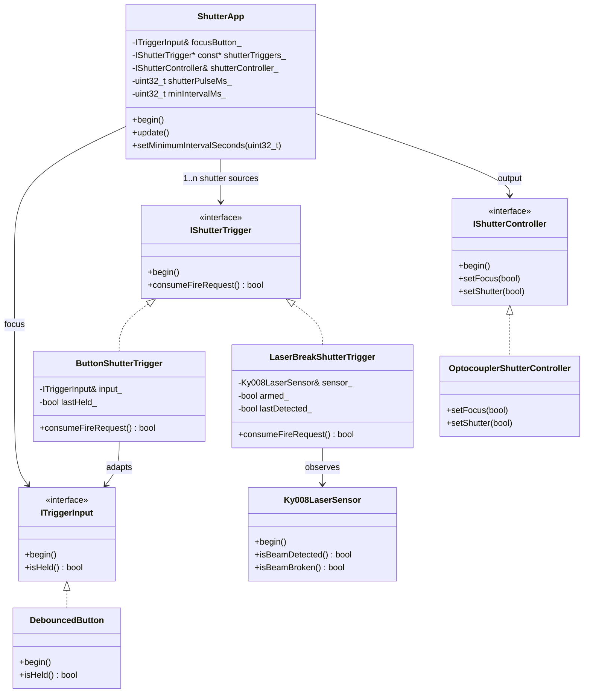

# ESP32 Shutter — Design Notes

This document describes the design of the shutter-control firmware after the
introduction of multiple trigger sources (push-buttons and a laser-break
sensor). It captures the considerations behind the refactor and the resulting
class structure.

---

## 1. Problem statement

The original firmware exposed two physical inputs:

- a **focus button** — while held, the camera's focus line is asserted;
- a **shutter button** — while held, the camera's shutter line is asserted.

Both inputs were modelled as `ITriggerInput` (a level signal via
`isHeld()`) and consumed directly by `ShutterApp`.

The new requirements introduce a **third trigger source**, a KY-008 laser
receiver. When the laser beam is interrupted, the shutter must fire. This
exposes a number of semantic differences that the previous design could not
express cleanly:

| Aspect            | Button (old)         | Laser break (new)                            |
|-------------------|----------------------|----------------------------------------------|
| Signal nature     | Level (`isHeld()`)   | Edge (detected → broken)                     |
| Repeat behaviour  | Repeats while held   | Must fire once, then re-arm on beam restore  |
| Number of sources | Exactly one          | Potentially many (button + laser + …)        |

Additionally, regardless of which source caused a firing, the device must
honour a **minimum interval** between two shutter activations (in seconds,
configurable at runtime).

---

## 2. Design considerations

### 2.1 Separating "focus" from "fire"

Focus and shutter activation have fundamentally different semantics in a
DSLR-style trigger:

- **Focus** is naturally a *level* signal: you press and hold while the
  camera autofocuses, then release.
- **Shutter** is naturally a *one-shot event*: the camera takes one picture
  per request. Even with a held button, the user's intent is "take a picture
  now", not "keep the shutter electrically asserted".

The new design preserves the existing `ITriggerInput` for focus and
introduces a dedicated abstraction for shutter triggers.

### 2.2 A dedicated trigger interface

Reusing `ITriggerInput::isHeld()` for the laser sensor would have forced
either:

- polling `isBeamBroken()` continuously (causing repeated firings while the
  beam stays broken), or
- adding edge-detection state directly into `ShutterApp`, mixing source-
  specific logic into the coordinator.

Instead a new interface `IShutterTrigger` was introduced. It exposes a
single method:

```cpp
bool consumeFireRequest();
```

Each implementation is responsible for its own edge detection / arming
logic. `ShutterApp` only needs to ask "did anything ask me to fire?" — it
remains agnostic of how that decision was reached.

### 2.3 Multiple trigger sources

`ShutterApp` accepts a fixed-size array of `IShutterTrigger*` plus its
length. This was preferred over `std::vector` for two reasons:

- the set of triggers is statically known at compile time;
- the firmware avoids dynamic allocation on the heap, which is good
  practice on embedded targets.

Adding a new trigger source later is a one-line change in `main.cpp`.

### 2.4 Pulse vs. level shutter output

Because shutter activation is now event-driven, the controller line cannot
be tied directly to a single input level. Instead, every accepted fire
request starts a **short pulse** of fixed length (`SHUTTER_PULSE_MS`,
default 200 ms). After the pulse elapses, `setShutter(false)` is called.
This matches how mechanical and electronic shutter releases are normally
driven.

### 2.5 Cooldown / minimum interval

A minimum interval between firings is enforced at the **coordinator**, not
inside individual triggers. This keeps the trigger implementations simple
and ensures the cooldown applies uniformly across all sources:

- a rapid button press immediately after a laser break is still suppressed;
- the cooldown is exposed as `setMinimumIntervalSeconds(uint32_t)` so it
  can be tuned at runtime (the constructor takes the initial value in ms).

While a trigger is in cooldown, all sources are still polled so their
internal state advances; their fire requests are simply discarded for that
update cycle. This avoids "stuck" edges after the cooldown ends.

### 2.6 Laser-break "arming"

The KY-008 sensor reports the current beam state on every poll. The
required behaviour is: *fire on the first detected→broken transition, then
do nothing until the beam is restored*. `LaserBreakShutterTrigger`
implements this with an `armed_` flag:

- on `begin()`: the trigger is armed only if the beam is currently
  detected — this prevents an immediate firing at startup if the beam
  happens to be broken;
- on each `consumeFireRequest()`:
  - if the beam is detected → `armed_ = true` (or stays true);
  - else if the previous reading was detected and the trigger is armed →
    fire once and set `armed_ = false`;
  - else → no event.

The result: at most one fire per *contiguous* beam-break, and the user must
restore the beam to re-arm the sensor.

---

## 3. Class structure



### Layers

- **Hardware-facing classes** (`DebouncedButton`, `Ky008LaserSensor`,
  `OptocouplerShutterController`) deal exclusively with pins, debouncing,
  and electrical levels. They have no opinion on what "the shutter" or "a
  trigger" means at the application level.
- **Adapters** (`ButtonShutterTrigger`, `LaserBreakShutterTrigger`)
  translate a hardware-facing reading into the `IShutterTrigger` contract.
  All edge-detection / arming logic lives here.
- **Coordinator** (`ShutterApp`) owns the timing — focus follow-through,
  pulse generation, cooldown, telemetry — and is completely decoupled from
  any specific hardware.
- **Composition root** (`main.cpp`) is the only place that knows the
  concrete types and the physical pin numbers (via `Config.h`).

---

## 4. Runtime flow

```mermaid
sequenceDiagram
    autonumber
    participant Loop as loop()
    participant App as ShutterApp
    participant Focus as DebouncedButton (focus)
    participant T as IShutterTrigger[*]
    participant Ctrl as OptocouplerShutterController

    Loop->>App: update()
    App->>Focus: isHeld()
    Focus-->>App: held / released
    App->>Ctrl: setFocus(held)

    loop For each shutter trigger
        App->>T: consumeFireRequest()
        T-->>App: true / false
    end

    alt fire requested AND cooldown elapsed AND no active pulse
        App->>Ctrl: setShutter(true)
        Note over App: store pulseStartTimeMs_ and lastFireTimeMs_
    else active pulse elapsed
        App->>Ctrl: setShutter(false)
    else otherwise (idle)
        App->>Ctrl: setShutter(false)
    end

    App-->>Loop: return
```

Key invariants:

- at most one shutter pulse is active at a time;
- a new pulse can start only when the previous pulse has ended **and** the
  minimum interval since the last firing has elapsed;
- focus is independent from shutter firing and changes within the same
  `update()` cycle as its input.

---

## 5. Configuration

`Config.h` exposes the values most likely to be tuned per build:

| Symbol                          | Meaning                                                    | Default |
|---------------------------------|------------------------------------------------------------|---------|
| `LASER_SENSOR_PIN`              | GPIO that the KY-008 receiver drives                       | 34      |
| `LASER_SENSOR_DETECTED_STATE`   | Logic level when the beam is detected                      | `LOW`   |
| `BUTTON_DEBOUNCE_MS`            | Debounce window for `DebouncedButton`                      | 50 ms   |
| `SHUTTER_PULSE_MS`              | Width of a single shutter pulse                            | 200 ms  |
| `SHUTTER_MIN_INTERVAL_S`        | Initial cooldown between firings (seconds)                 | 2 s     |
| `TELEMETRY_INTERVAL_MS`         | Period for the periodic `Serial` status line               | 500 ms  |

The cooldown can additionally be changed at runtime via
`ShutterApp::setMinimumIntervalSeconds()` /
`ShutterApp::setMinimumIntervalMs()`.

---

## 6. Extending the system

To add another shutter source (e.g. a sound trigger or a network command):

1. Implement `IShutterTrigger`. Encapsulate any required edge detection /
   arming logic inside the class.
2. Instantiate it in `main.cpp`.
3. Append it to the `shutterTriggers[]` array.

No changes to `ShutterApp` are required.

To change the firing semantics (e.g. fire on beam *restored* instead of
beam *broken*, or fire on button *release* instead of press), only the
relevant adapter is touched — the coordinator and hardware classes remain
untouched.
