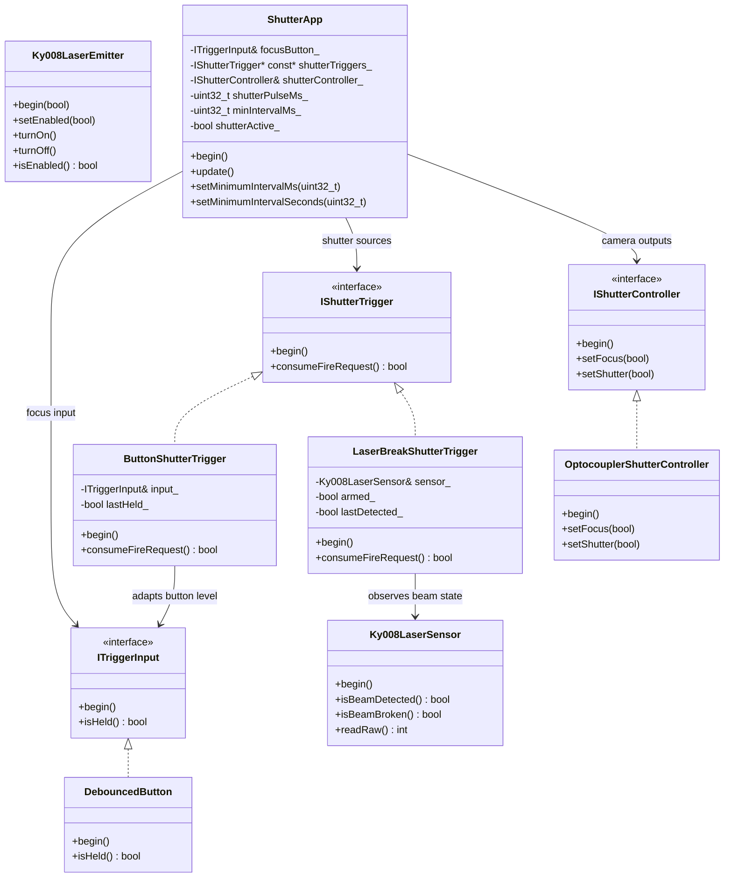

# ESP32 Shutter Design And Specification

**Target camera:** Canon EOS R6  
**Target MCU board:** ESP32-WROOM-32 DevKit  
**Firmware project:** `ESP32Shutter`  
**License:** GPL-3.0  
**Last updated:** 2026-05-30

This document is the combined hardware specification and firmware design note for
the ESP32 shutter controller. It replaces the older separate `SPECIFICATIONS.md`
file and documents the current source code, including the laser-break shutter
trigger.

---

## 1. Project Overview

`ESP32Shutter` implements a wired remote shutter release controller for the Canon
EOS R6 using an ESP32-WROOM-32 development board. Two 4N36 optocouplers provide
galvanic isolation between the ESP32 and the camera remote terminal, replacing the
mechanical switches found in a Canon RS-60E3-style remote.

The controller drives two camera lines:

- **Focus**: camera half-press / autofocus line.
- **Shutter**: camera full-press / release line.

The current firmware supports these user inputs and trigger sources:

- a focus pushbutton that directly controls the focus line while held;
- a shutter pushbutton that requests one shutter pulse per press;
- a KY-008 laser receiver that requests one shutter pulse when the beam is broken.

Focus remains level-based. Shutter firing is event-based: each accepted fire
request creates a fixed-width output pulse, and a shared cooldown prevents two
accepted shutter firings from occurring too close together.

---

## 2. Canon R6 Remote Terminal

The Canon EOS R6 exposes a 2.5 mm stereo TRS "Remote" jack, Canon's E3 remote
terminal.

| TRS contact | Signal | Trigger action |
|-------------|--------|----------------|
| Sleeve | GND | Camera circuit ground reference |
| Ring | Focus | Short to GND to initiate autofocus / half-press |
| Tip | Shutter | Short to GND to release shutter / full-press |

The camera supplies approximately 3.3 V / 0.5 mA on the Focus and Shutter lines.
Do not connect ESP32 GPIO pins directly to those camera lines. Use the optocoupler
isolation circuit described in this document.

The ESP32 ground and the camera sleeve ground are not connected together. The
optocouplers keep the ESP32 circuit and camera circuit galvanically isolated.

---

## 3. Hardware Components

| Component | Quantity | Notes |
|-----------|----------|-------|
| ESP32-WROOM-32 DevKit | 1 | 3.3 V GPIO logic |
| 4N36 optocoupler | 2 | One for Focus, one for Shutter |
| 220 ohm resistor | 4 | Two optocoupler input resistors, two LED resistors |
| LED, standard 3 mm or similar | 2 | Focus status and Shutter status |
| 2.5 mm TRS plug or cable | 1 | Wired to camera E3 remote jack |
| Momentary pushbutton | 2 | Focus and Shutter Release |
| KY-008 laser emitter | 1 | Prepared in code, not currently composed in `main.cpp` |
| KY-008-compatible laser receiver | 1 | Active shutter trigger source on GPIO 34 |
| Assorted resistors | As needed | Pull-downs, pull-ups, transistor base resistor |
| Breadboard or PCB, wires | As needed | Prototype or final assembly |

---

## 4. GPIO And Timing Configuration

`include/Config.h` is the source of truth for current firmware configuration.

| Symbol | Current value | Direction | Meaning |
|--------|---------------|-----------|---------|
| `FOCUS_PIN` | GPIO 25 | Output | Focus optocoupler drive |
| `SHUTTER_PIN` | GPIO 26 | Output | Shutter optocoupler drive |
| `FOCUS_LED_PIN` | GPIO 15 | Output | Focus status LED |
| `SHUTTER_LED_PIN` | GPIO 16 | Output | Shutter status LED |
| `FOCUS_BUTTON_PIN` | GPIO 18 | Input | Focus button |
| `SHUTTER_BUTTON_PIN` | GPIO 19 | Input | Shutter Release button |
| `LASER_EMITTER_PIN` | GPIO 32 | Output | Prepared laser emitter control |
| `LASER_SENSOR_PIN` | GPIO 34 | Input | Laser receiver signal |
| `LASER_SENSOR_DETECTED_STATE` | `LOW` | N/A | Receiver level while beam is present |
| `BUTTON_DEBOUNCE_MS` | 50 ms | N/A | Button debounce interval |
| `TELEMETRY_INTERVAL_MS` | 500 ms | N/A | Periodic serial status interval |
| `SHUTTER_PULSE_MS` | 200 ms | N/A | Width of one shutter output pulse |
| `SHUTTER_MIN_INTERVAL_S` | 2 s | N/A | Minimum interval between accepted firings |

GPIO 34 is input-only on the ESP32, which is appropriate for the laser receiver.
The current receiver configuration reports `LOW` while the beam is present and
therefore `HIGH` when the beam is broken.

GPIO 30 and GPIO 31 do not exist as usable pins on the ESP32-WROOM-32 module and
must not be used for this project.

---

## 5. Circuit Design

### 5.1 4N36 Input Resistor

The 4N36 input LED forward voltage is approximately 1.2 V. Driving it from a
3.3 V ESP32 GPIO at about 10 mA gives:

```text
R = (Vgpio - Vf) / If
R = (3.3 V - 1.2 V) / 0.010 A
R = 210 ohm
```

Use the next standard value, 220 ohm. This gives about 9.5 mA input current,
which is comfortably below the 4N36 absolute maximum and enough to sink the
camera-side 0.5 mA remote input current.

### 5.2 Focus Channel

```text
ESP32 GPIO 25 --[220 ohm]--> Anode   pin 1   4N36 #1 input side
ESP32 GND -----------------> Cathode pin 2

Camera Ring   Focus -------- Collector pin 5  4N36 #1 output side
Camera Sleeve GND ---------- Emitter   pin 4
```

When GPIO 25 is driven HIGH, the 4N36 LED turns on, the phototransistor conducts,
and the camera Focus line is shorted to camera GND.

### 5.3 Shutter Channel

```text
ESP32 GPIO 26 --[220 ohm]--> Anode   pin 1   4N36 #2 input side
ESP32 GND -----------------> Cathode pin 2

Camera Tip    Shutter ------ Collector pin 5  4N36 #2 output side
Camera Sleeve GND ---------- Emitter   pin 4
```

When GPIO 26 is driven HIGH, the 4N36 conducts and the camera Shutter line is
shorted to camera GND.

### 5.4 Status LEDs

The status LEDs mirror the output state of the matching optocoupler channel.

```text
ESP32 GPIO 15 --> Focus LED anode
Focus LED cathode --[220 ohm]--> ESP32 GND

ESP32 GPIO 16 --> Shutter LED anode
Shutter LED cathode --[220 ohm]--> ESP32 GND
```

When the focus output is active, the focus LED is ON. When the shutter output is
active, the shutter LED is ON.

### 5.5 Pushbuttons

The current firmware implementation of `DebouncedButton` configures button pins
with `INPUT` and treats `digitalRead(pin) == HIGH` as pressed. That means the
current code expects an active-high button signal, typically with an external
pull-down and a button or module that drives the pin HIGH when pressed.

If the buttons are instead wired directly from GPIO to GND and use the ESP32
internal pull-up (`INPUT_PULLUP`), then a press reads LOW. That wiring style is
valid hardware, but the firmware must be changed to configure `INPUT_PULLUP` and
treat LOW as pressed.

Current source-backed behavior:

| GPIO | Firmware input mode | Pressed state expected by code |
|------|---------------------|--------------------------------|
| GPIO 18 | `INPUT` | `HIGH` |
| GPIO 19 | `INPUT` | `HIGH` |

### 5.6 Laser Receiver

The current firmware reads a laser receiver on GPIO 34 through `Ky008LaserSensor`.
It is constructed with `INPUT` mode and `LASER_SENSOR_DETECTED_STATE = LOW`.

| Beam state | GPIO 34 reading | Firmware interpretation |
|------------|-----------------|-------------------------|
| Beam present | `LOW` | `isBeamDetected() == true` |
| Beam broken | `HIGH` | `isBeamBroken() == true` |

`LaserBreakShutterTrigger` fires once on the detected-to-broken transition and
then waits for the beam to be restored before re-arming.

### 5.7 Laser Emitter

`Ky008LaserEmitter` exists in the source tree and can drive a GPIO-controlled
emitter, but it is not currently instantiated in `src/main.cpp`. The active
firmware reads the receiver and does not yet control laser power.

For full laser module brightness, power the KY-008 emitter from 5 V / VIN and use
a small NPN transistor such as a 2N2222 as a low-side switch controlled by an ESP32
GPIO through a base resistor.

Recommended switching circuit:

```text
ESP32 GPIO 32 --[1k ohm]--> 2N2222 base
2N2222 emitter -----------> ESP32 GND
2N2222 collector ---------> KY-008 negative / ground pin
ESP32 5V or VIN ----------> KY-008 signal / positive supply pin
```

For a common 2N2222 package, verify the exact datasheet pinout before wiring. Some
packages use emitter-base-collector from left to right when looking at the flat
side with the pins down; others differ.

---

## 6. Electrical Summary

```text
ESP32-WROOM-32

GPIO 25 --[220 ohm]--> 4N36 #1 input LED   -> Camera Ring  Focus
GPIO 26 --[220 ohm]--> 4N36 #2 input LED   -> Camera Tip   Shutter
GPIO 15 -------------> Focus LED --[220 ohm]--> ESP32 GND
GPIO 16 -------------> Shutter LED --[220 ohm]--> ESP32 GND
GPIO 18 -------------> Focus pushbutton input, active HIGH in current firmware
GPIO 19 -------------> Shutter pushbutton input, active HIGH in current firmware
GPIO 34 -------------> Laser receiver input, LOW means beam present
GPIO 32 -------------> Prepared laser emitter control output

Camera 2.5 mm TRS plug

Sleeve GND ----------> 4N36 #1 emitter and 4N36 #2 emitter
Ring Focus ----------> 4N36 #1 collector
Tip Shutter ---------> 4N36 #2 collector

Important: ESP32 GND and camera Sleeve GND remain isolated from each other.
```

---

## 7. Functional Requirements

### 7.1 Focus Operation

The focus button is level-based.

| Condition | Action |
|-----------|--------|
| Focus button held | Assert Focus: GPIO 25 HIGH, focus LED ON |
| Focus button released | Release Focus: GPIO 25 LOW, focus LED OFF |

Focus remains active for as long as the debounced focus input is held. It is
independent of shutter firing.

### 7.2 Shutter Button Operation

The shutter button is event-based in the current firmware.

| Condition | Action |
|-----------|--------|
| Shutter button changes from released to held | Request one shutter pulse |
| Shutter button remains held | No additional requests |
| Shutter button is released and pressed again | Request another pulse, subject to cooldown |

This differs from a purely mechanical RS-60E3 remote, where holding the shutter
switch would hold the shutter contact closed. The current firmware uses pulse
generation so the same output behavior can be shared by manual and laser triggers.

### 7.3 Laser Break Operation

The laser trigger is also event-based.

| Condition | Action |
|-----------|--------|
| Beam detected at startup | Trigger starts armed |
| Beam already broken at startup | Trigger starts disarmed |
| Armed beam changes from detected to broken | Request one shutter pulse |
| Beam remains broken | No additional requests |
| Beam is restored | Trigger re-arms |

This produces at most one exposure per contiguous beam interruption.

### 7.4 Combined Operation

Focus and shutter are independent. A typical focused shot is:

| Step | User action | Result |
|------|-------------|--------|
| 1 | Press and hold Focus | Focus line is asserted |
| 2 | Press Shutter while holding Focus | One shutter pulse is requested |
| 3 | Release Shutter | No direct output change unless a pulse is active |
| 4 | Release Focus | Focus line is released |

If a shutter request occurs without focus held, only the shutter line pulses. This
is useful with manual focus or when focus has already been acquired.

### 7.5 Status LEDs

| Condition | Focus LED | Shutter LED |
|-----------|-----------|-------------|
| Focus active | ON | Unchanged |
| Focus inactive | OFF | Unchanged |
| Shutter pulse active | Unchanged | ON |
| Shutter pulse inactive | Unchanged | OFF |

The LEDs are driven through the same controller calls as the optocoupler outputs,
so they reflect logical output state with no separate timing path.

### 7.6 Debounce, Idle, And Serial Output

- Both buttons are debounced in software with a 50 ms default interval.
- In idle, GPIO 25, GPIO 26, GPIO 15, and GPIO 16 are LOW.
- Serial logging runs at 115200 baud.
- `ShutterApp` prints periodic telemetry every 500 ms by default.

---

## 8. Camera Timing Notes

Canon's published still-photo burst limits for the EOS R6 are approximately:

| Mode | Burst rate | Time between frames |
|------|------------|---------------------|
| Mechanical shutter | 12 fps | About 83 ms |
| Electronic shutter | 20 fps | About 50 ms |

The camera is the dominant speed limit. A faster GPIO toggle or faster optocoupler
will not make the R6 shoot faster than its rated burst speed.

Practical guidance:

- For repeated shots using the E3 input, design around 12 Hz mechanical or 20 Hz electronic.
- If scheduling one pulse per frame, do not schedule rising edges faster than about 83 ms for mechanical shutter or 50 ms for electronic shutter.
- For the highest reliable burst rate, use camera continuous-drive mode and keep the shutter contact closed for the intended burst duration.
- A 4N36-class phototransistor optocoupler is fast enough for 12 to 20 fps by a wide margin at the low camera-side current involved here.

Canon does not appear to publish a guaranteed E3 remote minimum pulse width or
maximum remote pulse repetition rate, so the 200 ms firmware pulse is a practical
default rather than a Canon-specified value.

---

## 9. Build Context

The project is a PlatformIO Arduino application.

| Setting | Value |
|---------|-------|
| Platform | `espressif32` |
| Board | `esp32dev` |
| Framework | `arduino` |
| Serial speed | `115200` |

Useful commands from the `ESP32Shutter/` project folder:

```powershell
platformio run
platformio run --target upload
platformio device monitor
```

The firmware uses Arduino core APIs such as `pinMode()`, `digitalRead()`,
`digitalWrite()`, `millis()`, and `Serial`.

---

## 10. Runtime Composition

`src/main.cpp` is the composition root. It creates all long-lived objects at file
scope and connects the interfaces together.

Current object graph:

- `DebouncedButton focusButton` reads the focus button.
- `DebouncedButton shutterButton` reads the shutter button.
- `Ky008LaserSensor laserSensor` reads the laser receiver on GPIO 34.
- `ButtonShutterTrigger buttonTrigger` adapts the shutter button into a fire event.
- `LaserBreakShutterTrigger laserTrigger` adapts beam breaks into fire events.
- `IShutterTrigger* shutterTriggers[]` contains both shutter sources.
- `OptocouplerShutterController shutterController` drives focus, shutter, and LEDs.
- `ShutterApp app` coordinates focus level control, shutter pulses, cooldown, and telemetry.

Arduino entry points:

```cpp
void setup() {
  Serial.begin(115200);
  shutterButton.begin();
  laserSensor.begin();
  app.begin();
}

void loop() { app.update(); }
```

`app.begin()` initializes the focus input, all registered shutter triggers, and
the output controller. The source currently initializes `shutterButton` and
`laserSensor` before calling `app.begin()` because the trigger adapters seed their
edge state from already configured hardware.

---

## 11. Firmware Architecture

The firmware is organized around three small interfaces and several concrete
hardware or adapter classes.

### 11.1 Level Input: `ITriggerInput`

`ITriggerInput` represents a held/not-held input.

```cpp
class ITriggerInput {
 public:
   virtual ~ITriggerInput() = default;
   virtual void begin() = 0;
   virtual bool isHeld() = 0;
};
```

The focus button uses this interface directly because focus is level-based.

### 11.2 One-Shot Shutter Source: `IShutterTrigger`

`IShutterTrigger` represents a discrete fire event.

```cpp
class IShutterTrigger {
 public:
   virtual ~IShutterTrigger() = default;
   virtual void begin() = 0;
   virtual bool consumeFireRequest() = 0;
};
```

`consumeFireRequest()` returns `true` once for a logical event and then clears or
advances the implementation's internal state.

### 11.3 Output Controller: `IShutterController`

`IShutterController` is the output-side abstraction used by the app.

```cpp
class IShutterController {
 public:
   virtual ~IShutterController() = default;
   virtual void begin() = 0;
   virtual void setFocus(bool active) = 0;
   virtual void setShutter(bool active) = 0;
};
```

The current concrete implementation is `OptocouplerShutterController`.

---

## 12. Trigger Semantics

| Feature | Focus button | Shutter button | Laser break |
|---------|--------------|----------------|-------------|
| Class | `DebouncedButton` | `ButtonShutterTrigger` over `DebouncedButton` | `LaserBreakShutterTrigger` over `Ky008LaserSensor` |
| Signal type | Level | Edge/event | Edge/event |
| Active condition | Button held | Released to held transition | Detected to broken transition |
| Output behavior | Output follows button | Starts fixed pulse | Starts fixed pulse |
| Repeat behavior | Continuous while held | One fire per press | One fire per beam break, then re-arm on beam restore |
| Cooldown applies | No | Yes | Yes |

---

## 13. Shutter Pulse And Cooldown

`ShutterApp` owns all shutter timing policy.

On every `update()` call it polls every registered `IShutterTrigger`, even during
cooldown. Polling all sources every loop is deliberate: it lets each adapter keep
its internal edge or arming state current even when the app discards a request.

The app starts a shutter pulse only when all of these are true:

- at least one trigger returned `true`;
- no shutter pulse is currently active;
- the minimum interval since the previous accepted firing has elapsed.

When a pulse starts:

1. `shutterActive_` becomes `true`.
2. `pulseStartTimeMs_` and `lastFireTimeMs_` are set to `millis()`.
3. `shutterController_.setShutter(true)` asserts the optocoupler and LED.
4. `Serial.println("Shutter: FIRE")` is emitted.

When `SHUTTER_PULSE_MS` has elapsed, the app calls
`shutterController_.setShutter(false)` and the output returns low.

The cooldown can be changed at runtime with:

```cpp
app.setMinimumIntervalMs(intervalMs);
app.setMinimumIntervalSeconds(seconds);
```

---

## 14. Runtime Flow

```mermaid
sequenceDiagram
    autonumber
    participant Loop as loop()
    participant App as ShutterApp
    participant Focus as DebouncedButton focus
    participant Button as ButtonShutterTrigger
    participant Laser as LaserBreakShutterTrigger
    participant Ctrl as OptocouplerShutterController

    Loop->>App: update()
    App->>Focus: isHeld()
    Focus-->>App: held or released
    App->>Ctrl: setFocus(focusHeld)

    App->>Button: consumeFireRequest()
    Button-->>App: fire or no fire
    App->>Laser: consumeFireRequest()
    Laser-->>App: fire or no fire

    alt fire requested and cooldown elapsed and no pulse active
        App->>Ctrl: setShutter(true)
        Note over App: start pulse and record last fire time
    else active pulse elapsed
        App->>Ctrl: setShutter(false)
    else idle between pulses
        App->>Ctrl: setShutter(false)
    end
```

Key invariants:

- focus and shutter are independent;
- only one shutter pulse can be active at a time;
- each accepted shutter request produces a pulse instead of a held output;
- the cooldown is shared by the button trigger and the laser trigger;
- laser state is consumed continuously so beam restore/break transitions do not get stuck behind the cooldown.

---

## 15. Class Diagram



---

## 16. Hardware-Facing Classes

### 16.1 `DebouncedButton`

`DebouncedButton` implements a non-blocking debounce algorithm using `millis()`.
It stores the last raw state, stable state, and timestamp of the most recent raw
transition.

Current source behavior:

- configures the pin with `pinMode(pin_, INPUT)`;
- treats `digitalRead(pin_) == HIGH` as pressed;
- promotes the raw state to the stable state after `BUTTON_DEBOUNCE_MS`.

### 16.2 `Ky008LaserSensor`

`Ky008LaserSensor` wraps the receiver input and exposes three views:

- `readRaw()` returns the raw `digitalRead()` value;
- `isBeamDetected()` compares the raw value to `beamDetectedState_`;
- `isBeamBroken()` returns the inverse of `isBeamDetected()`.

In the current composition, it is constructed as:

```cpp
Ky008LaserSensor laserSensor(Config::LASER_SENSOR_PIN, INPUT,
                             Config::LASER_SENSOR_DETECTED_STATE);
```

That means GPIO 34 is read as a plain input and `LOW` means the laser beam is present.

### 16.3 `Ky008LaserEmitter`

`Ky008LaserEmitter` can configure an output pin, turn the emitter on or off, and
report its last commanded state. It is available for future emitter control but is
not currently used by `main.cpp`.

### 16.4 `OptocouplerShutterController`

The output controller owns four GPIO pins: focus, shutter, focus LED, and shutter
LED. `begin()` configures all four as outputs and drives them low for a safe idle
state.

`setFocus()` and `setShutter()` cache their previous logical state. They only call
`digitalWrite()` and print a transition message when the requested state changes.
Each LED mirrors its matching optocoupler output.

---

## 17. Serial Output

The firmware prints at 115200 baud.

Output types:

- controller initialization: `Shutter controller initialized: focus=LOW, shutter=LOW`;
- app initialization: `Shutter app ready`;
- focus transitions: `Focus asserted (HIGH)` or `Focus released (LOW)`;
- shutter transitions: `Shutter asserted (HIGH)` or `Shutter released (LOW)`;
- accepted fire events: `Shutter: FIRE`;
- periodic telemetry every 500 ms by default.

Telemetry format:

```text
focus=ON, shutter=OFF, cooldown_ms=2000
```

---

## 18. Extending The System

To add a new shutter source, implement `IShutterTrigger`, instantiate it in
`main.cpp`, and append it to `shutterTriggers[]`.

Examples:

- sound trigger;
- network command;
- timer intervalometer;
- analog threshold trigger;
- delayed laser trigger after a potentiometer-selected wait time.

Keep source-specific edge detection, arming, or threshold logic inside the trigger
adapter. Keep shared shutter timing policy in `ShutterApp` so every source uses the
same pulse and cooldown rules.

Future hardware or firmware additions:

1. **Delay mode**: delay laser-triggered shutter release by a variable amount,
   likely set by a 10K potentiometer.
2. **Display or feedback**: show delay time on a small numeric display, such as a
   multi-digit segment display.
3. **Battery power**: add a battery and suitable charging / protection circuit.
4. **Laser emitter control**: compose `Ky008LaserEmitter` into the runtime if the
   ESP32 should switch laser power.

---

## 19. Current Gaps And Follow-Ups

The current source implements the active laser-trigger architecture, but a few
items remain worth tracking:

1. **Button wiring must match firmware polarity**: the code currently expects
   active-high `INPUT` buttons. If the physical build uses GPIO-to-GND buttons with
   `INPUT_PULLUP`, update `DebouncedButton` accordingly.
2. **Laser emitter not composed**: `Ky008LaserEmitter` exists but is not used by
   `main.cpp`. The firmware currently reads the receiver but does not control laser
   power.
3. **Startup initialization is split**: `main.cpp` initializes `shutterButton` and
   `laserSensor` before `app.begin()`, while `app.begin()` initializes focus and
   triggers. This works, but ownership would be clearer if each adapter initialized
   its dependency or if `main.cpp` initialized all hardware explicitly.
4. **Cooldown unit API**: `Config` stores `SHUTTER_MIN_INTERVAL_S`, while
   `ShutterApp` stores milliseconds. This is handled correctly at construction, but
   future UI code should be explicit about units.
5. **`lastFocusHeld_` is currently unused for behavior**: it is stored at the end of
   `update()` but does not affect decisions. It can be removed unless upcoming edge
   logic needs it.

---

## 20. Summary

The project combines an electrically isolated Canon E3 remote interface with a
small event-driven firmware architecture:

- focus follows the focus button directly;
- the shutter button produces one fire request per press;
- the laser sensor produces one fire request per beam break;
- every accepted request creates a fixed-width shutter pulse;
- a shared cooldown applies across all shutter sources;
- LEDs mirror the actual focus and shutter outputs;
- the camera-side circuit remains isolated from ESP32 ground through the 4N36
  optocouplers.

This structure keeps hardware reads, trigger semantics, and camera output timing in
separate classes, which should make delayed laser triggering, display feedback, and
power-management additions easier to add without collapsing the application back
into a monolithic `loop()`.
